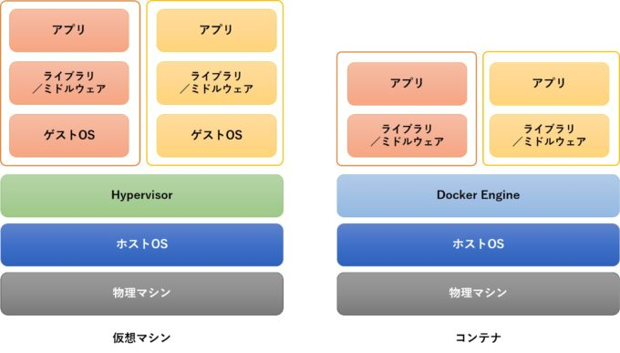

# Docker


<br>
## Dockerとは？

コンテナ型の仮想環境を作成、配布、実行するためのプラットフォーム．要するに仮想環境の一種（厳密には違う）．


**従来の仮想環境との差異**

- コード化されたファイルを共有することで、どこでも誰でも同じ環境が作れる
- 作成した環境を配布しやすい
  - 環境をファイルにして保存できる
- スクラップ＆ビルドが容易にできる
  - コマンド一つで作れたり消したり




<br>

**イメージとコンテナ**

- イメージ：アプリケーションの実行環境の雛形
- コンテナ：アプリケーションの実行環境(実体)
- イメージをベースにしてコンテナを作成


<br>
## Dockerの導入

- 公式からインストーラを落とす方法

  - https://docs.docker.com/docker-for-mac/install/ から

- homebrewを使う方法（macOS）

  ```bash
  $ brew install docker
  $ brew cask install docker
  ```

  


<br>
## チュートリアル


**イメージのダウンロード**

`docker pull 取得するイメージ名:タグ`で，Docker Hub(後述)からイメージを引っ張ってくる．

例：Ubuntuの最新バージョンのイメージをダウンロード．

```bash
$ docker pull ubuntu:latest
```


**保存してあるイメージの一覧表示**

```bash
$ docker image ls
REPOSITORY          TAG                 IMAGE ID            CREATED             SIZE
ubuntu              latest              47b19964fb50        1 months ago       88.1MB

```


**コンテナの起動**

基本的に，`docker run イメージ名`で，イメージをベースにしてコンテナを作成(起動)

```bash
$ docker run ubuntu
```

これだとコンテナが起動してすぐ停止する．

→オブションをつける


```bash
$ docker run -it ubuntu
```


- オプション
  - `-i`：ホスト側からコンテナ側への入力を認める
  - `-t`：コンテナ側からホスト側への入力を認める


**起動しているコンテナの一覧表示**

```bash
$ docker ps -a
CONTAINER ID        IMAGE               COMMAND             CREATED             STATUS                       PORTS               NAMES
446e676e86b1        ubuntu:latest       "ls"                11 months ago       Exited (0) 11 months ago                         condescending_archimedes
f2f13fd09819        ubuntu:latest       "/bin/bash"         11 months ago       Exited (255) 11 months ago                       vibrant_liskov

```


オプション

- `-a`：停止してるコンテナも表示


**コンテナの停止・再開**

コンテナ側で，「Ctrl + P + Q」でコンテナからログアウト(停止, detach)する．

ホスト側で，`docker attach コンテナID`で，コンテナへログイン(再開, attach)する．

```bash
$ docker attach 94b9e29221aa
```

あるいは，

```bash
$ docker exec -it 94b9e29221aa /bin/bash
```


<br>
## nvidia-docker

DockerでNVIDIA社製のGPUを使いたいときに用いる

- Macbookに搭載されているGPUはNVIDIA社製ではない．

- NVIDIA-GPUが搭載されたLinuxマシンで使う．
  - GPUは機械学習で使うモデルの学習に使う．
  - AWS EC2, GCP VM, MS AzureなどのクラウドマシンではNVIDIA-GPUを提供


<br>
## Docker Hub

[https://hub.docker.com/](https://hub.docker.com/)


- 様々なイメージがあるサイト
- 取得したいイメージを検索
- 自分で作ったイメージをアップロードも可能


`docker pull 取得したいイメージのリポジトリ名`で，イメージをダウンロード可能．


## Dockderfile

- イメージを作成するための設定ファイル
- 用いるイメージや実行するコマンドなどを記述


**コマンドでDockerfileからイメージを作成**

`docker build <Dockerfileのパス> -t <コンテナ名>`で，イメージを作成可能．

```bash
$ docker build ./ -t example_container
```


!!! docker build

- [https://docs.docker.com/engine/reference/commandline/build/](https://docs.docker.com/engine/reference/commandline/build/)]


<br>

## 参考文献

- [Docker Documentation (日本語)]([http://docs.docker.jp/](http://docs.docker.jp/))
- [Docker Documentation](https://docs.docker.com/)
