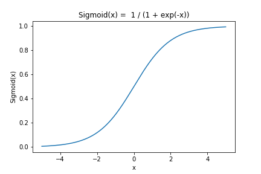

# 3.ロジスティック回帰

Breast Cancer Wisconsin（Diagnostic）Data Setでロジスティック回帰してみよう

**シグモイド関数，ロジット，オッズ**

1. オッズ

オッズ(odds)とは､「ある事象が起こる確率$$p$$と起こらない確率$$1-p$$の比」です．オッズは確率の定義域$$[0,1]$$を，正の実数の範囲$$[0, \infty]$$に広げます．

$$
odds(p) := \frac{p}{1-p} ~~~ (0 \lt p \lt 1)
$$

 

2. 対数オッズ(ロジット)

オッズを対数変換したものを，対数オッズ(ロジット, logit)といいます．対数オッズは確率の定義域$$[0,1]$$を，実数の範囲$$[-\infty, \infty]$$に広げます．
$$
logit(p) = \log \left( \frac{p}{1 - p} \right) ~~~ (0 \lt p \lt 1)
$$

 

3. シグモイド関数(ロジスティック関数)

ロジット関数の逆関数を，シグモイド関数(ロジスティック関数)といいます．シグモイド関数は実数全体$$[-\infty, \infty]$$を確率の定義域$$[0,1]$$へ変換します．また，2クラス分類の場合，クラスラベルを$$0,1$$と設定することで，予測ラベルの出力にシグモイド関数を使うことができます．
$$
{\rm Sigmoid}(x) = \frac{1}{1 + \exp(-x)} ~~~ (-\infty \lt x \lt \infty)
$$

 

※ Nクラス分類への拡張: ソフトマックス関数

2クラス分類では，シグモイド関数を活用することで連続値変数に対する回帰と同じ問題設定をとることができました．同様に，Nクラス分類では，シグモイド関数を拡張したソフトマックス関数が使われます.
$$
{\rm Softmax}({\bf x})_i = \frac{\exp(x_i)}{\sum_{i=1}^{n} \exp(x_i)}
$$

**ロジスティック回帰**

**今回のシナリオ**

今回は，ボストン市の住宅価格(class)を目的変数にして線形回帰モデル$$f$$を作ります.関数$f$は4次元ベクトル$${\bf x} \in \mathbb{R}^{4}$$から実数値$$y \in \mathbb{R}$$への写像を4元多項式で表しています.$$u$$は関数$$f$$では表現できなかった部分を補正する誤差項です．
$$
\log \left( \frac{y}{1 - y} \right) = f({\bf x}) + u \\
y = \frac{1}{1 + \exp (- f({\bf x}))} + u
$$
具体的には，以下のデータを使います．

- 目的変数 (1コ)
  - $$y~ ~ $$ : class - 腫瘍の判定結果（悪性: 0, 良性: 1）
- 説明変数 (4コ)
  - $$x_1$$ : mean concave points - 細胞にある凹みの平均個数
  - $$x_2$$ : symmetry error - 細胞の左右の非対称性の度合い
  - $$x_3$$ : texture error - 細胞表面の明暗の標準偏差
  - $$x_4$$ : 細胞の平均半径
- 誤差項　
  - $$u$$ ： 平均0の正規分布に従うと仮定．

$$
\begin{align}
y = \beta_0 + \beta_1 x_1 + \cdots + \beta_6 x_6 + u, ~~~
u \sim \mathcal{N}(0, \sigma^2)
\end{align}
$$



